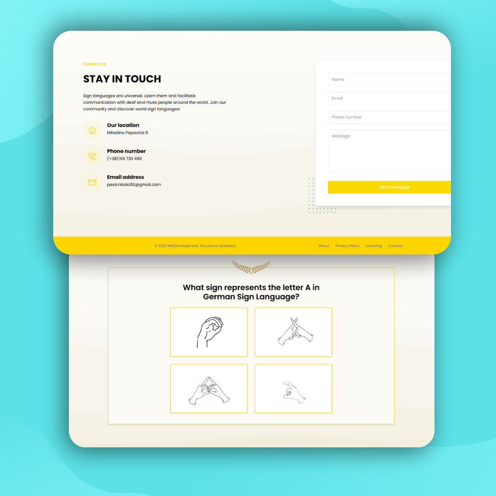

# Welcome to Znakovito: Vaš vodič kroz svetske znakovne jezike! 🌟

Naučite, razumite, povežite se - sve sa jednom aplikacijom!

---
### Projekat Hakatona

Ova aplikacija je napravljena kao projekat za hakaton od strane FON-a i osvojila je 3. mesto na tom takmičenju. Iako je već postigla uspeh, aplikacija treba dodatno da se doradi kako bi postala pravi, funkcionalni proizvod.

### Zašto Znakovito?

🌍 **Svetski znakovni jezici**: Različite zemlje, različiti znakovni jezici. Sa Znakovitom, prevaziđite jezičke barijere i naučite znakovni jezik iz bilo koje zemlje.

🔊 **Prevod zvuka i teksta**: Bilo da koristite glasovne poruke, tekstualni unos ili audio fajlove, Znakovito nudi precizan prevod na znakovni jezik - prilagođen različitim lokalnim dijalektima.

🧠 **Učenje kroz igre**: Istražite naš kviz za jednog igrača, koji omogućava brzo učenje novih znakovnih jezika dok putujete ili se pripremate za komunikaciju na novim lokacijama.

💑 **Kviz za dva igrača**: Povežite se sa svojim partnerom, prijateljem ili članom porodice kroz izazovni kviz, gde se vaše veštine u znakovnom jeziku ocenjuju.

  

---

### Specifičnost srpskog znakovnog jezika

Srpski znakovni jezik se razlikuje od mnogih drugih jer koristi dvoručne znakove, dok većina drugih zemalja koristi jednoručne znakove. Učenje ovih razlika može biti izazovno, ali Znakovito vam pomaže da savladate ove jedinstvene karakteristike.

---

### Statistika:

Postoji preko 466 miliona ljudi koji su gluvi ili nagluvi širom sveta. To znači da je znakovni jezik važan za poznavanje kako bi se svet učinio boljim mestom.

---

Naša aplikacija omogućava korisnicima da brzo i efikasno uče znakovne jezike. Bilo da putujete u inostranstvo ili želite da komunicirate sa gluvim ili nagluvim osobama, naša aplikacija vam pomaže da savladate osnovne znakove.
Sa našom aplikacijom, možete učiti znakovne jezike iz različitih zemalja. Otkrijte razlike i sličnosti među njima i budite spremni za svoja putovanja.

### Zašto je važno učiti znakovne jezike?

**Brakovi i veze**: Statistike pokazuju da parovi koji komuniciraju koristeći znakovni jezik imaju jače veze i bolje razumevanje.

**Lakše putovanje**: Različite zemlje imaju različite znakovne jezike. Naša aplikacija vam omogućava da se pripremite za putovanja i komunicirate sa lokalnim stanovništvom.

**Prevazilaženje jezičkih barijera**: Znakovni jezici su univerzalni. Naučite ih i olakšajte komunikaciju sa gluvim ili nagluvim osobama širom sveta.

  

Pridružite se našoj zajednici i istražite svetske znakovne jezike!
Neka znakovi postanu vaš jezik! 🤟🌍

*Znakovito - Naučite, razumite, povežite se!* 🌟
